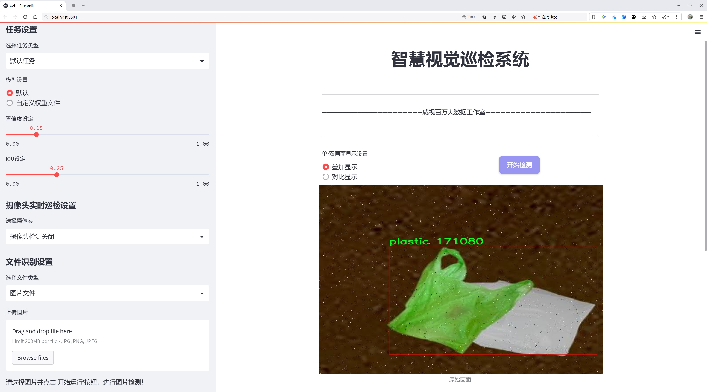
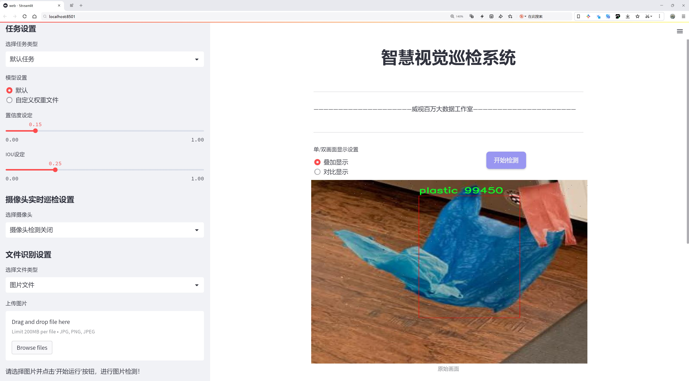
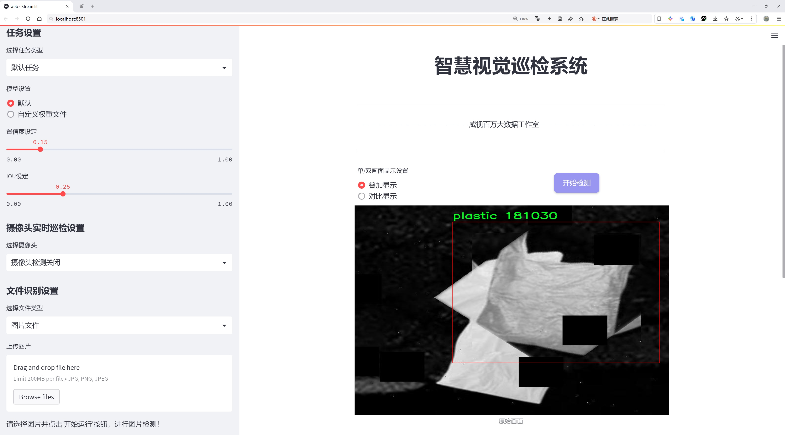
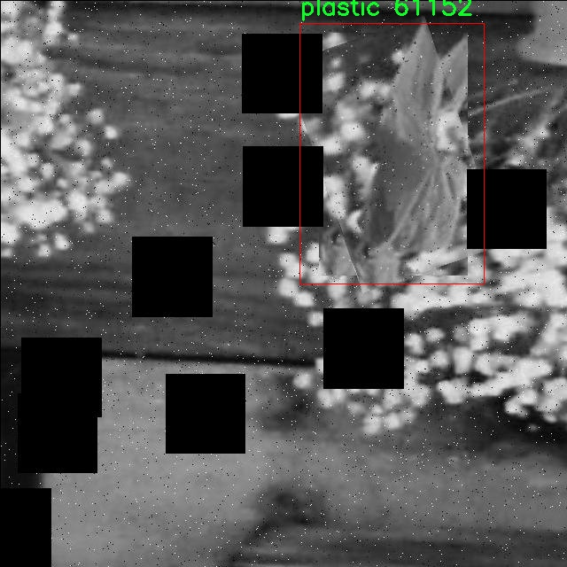
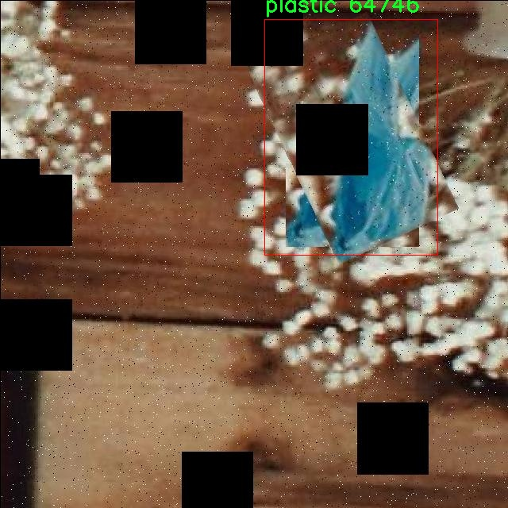
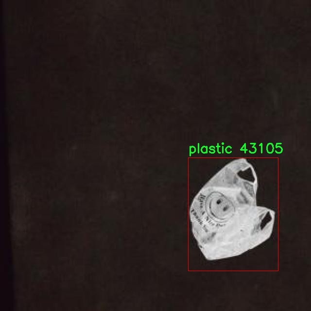
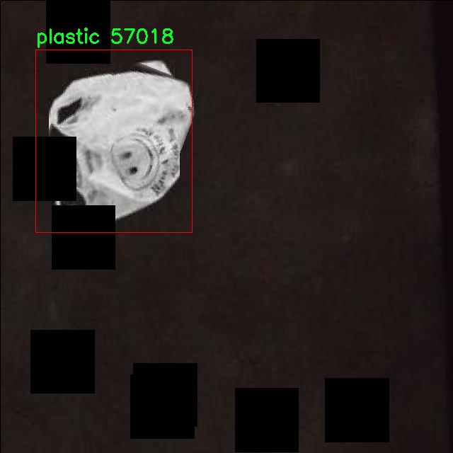
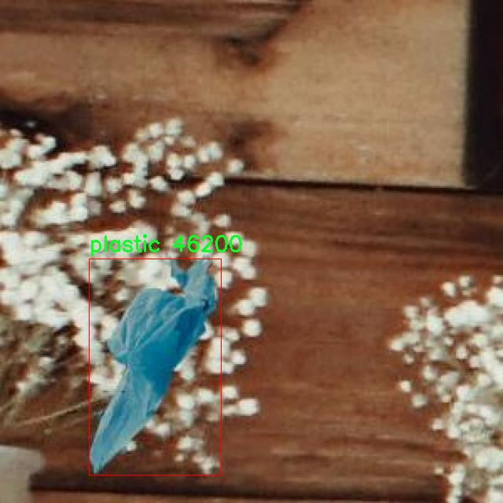

# 垃圾分类检测检测系统源码分享
 # [一条龙教学YOLOV8标注好的数据集一键训练_70+全套改进创新点发刊_Web前端展示]

### 1.研究背景与意义

项目参考[AAAI Association for the Advancement of Artificial Intelligence](https://gitee.com/qunmasj/projects)

项目来源[AACV Association for the Advancement of Computer Vision](https://kdocs.cn/l/cszuIiCKVNis)

研究背景与意义

随着城市化进程的加快和人口的不断增长，垃圾产生量逐年上升，垃圾分类已成为现代社会可持续发展的重要环节。垃圾分类不仅有助于资源的回收利用，减少环境污染，还能提升公众的环保意识，促进生态文明建设。近年来，人工智能技术的迅猛发展为垃圾分类提供了新的解决方案，尤其是计算机视觉领域的进步，使得基于深度学习的物体检测方法在垃圾分类中展现出巨大的潜力。

YOLO（You Only Look Once）系列模型作为一种高效的目标检测算法，因其快速和准确的特性而广泛应用于各类物体检测任务。YOLOv8作为该系列的最新版本，进一步提升了检测精度和速度，适合在实时垃圾分类场景中应用。然而，尽管YOLOv8在物体检测领域表现出色，但在特定的垃圾分类任务中，仍然面临着诸如类别不平衡、复杂背景干扰等挑战。因此，改进YOLOv8以适应垃圾分类的需求，具有重要的研究意义。

本研究所采用的数据集包含7984张图像，涵盖了8个垃圾分类类别，包括其他、垃圾桶、可堆肥物、一般垃圾、玻璃、金属、塑料和可回收物。这一丰富的数据集为模型的训练和评估提供了坚实的基础。通过对不同类别的垃圾进行细致的标注和分类，研究能够有效地提高模型对各类垃圾的识别能力，进而提升垃圾分类的准确性和效率。

改进YOLOv8的垃圾分类检测系统不仅可以为城市垃圾管理提供技术支持，还能推动智能垃圾分类设备的研发与应用。通过将该系统集成到智能垃圾桶、垃圾分类机器人等设备中，可以实现自动识别和分类，减少人工干预，提高垃圾分类的自动化水平。此外，该系统的推广应用也将促进公众对垃圾分类的参与和重视，提升社会整体的环保意识。

从更广泛的角度来看，垃圾分类检测系统的研究不仅是对技术的探索，更是对社会责任的担当。随着全球环境问题的日益严重，如何有效地管理和处理垃圾已成为各国政府和社会各界亟待解决的课题。通过本研究的深入，期望能够为垃圾分类提供更为高效的技术手段，助力实现可持续发展的目标。

综上所述，基于改进YOLOv8的垃圾分类检测系统的研究，既具有重要的理论价值，也具备广泛的实际应用前景。通过对该系统的研究与实践，将为推动垃圾分类的智能化、自动化进程提供有力支持，为建设美丽城市、保护生态环境贡献一份力量。

### 2.图片演示







##### 注意：由于此博客编辑较早，上面“2.图片演示”和“3.视频演示”展示的系统图片或者视频可能为老版本，新版本在老版本的基础上升级如下：（实际效果以升级的新版本为准）

  （1）适配了YOLOV8的“目标检测”模型和“实例分割”模型，通过加载相应的权重（.pt）文件即可自适应加载模型。

  （2）支持“图片识别”、“视频识别”、“摄像头实时识别”三种识别模式。

  （3）支持“图片识别”、“视频识别”、“摄像头实时识别”三种识别结果保存导出，解决手动导出（容易卡顿出现爆内存）存在的问题，识别完自动保存结果并导出到tempDir中。

  （4）支持Web前端系统中的标题、背景图等自定义修改，后面提供修改教程。

  另外本项目提供训练的数据集和训练教程,暂不提供权重文件（best.pt）,需要您按照教程进行训练后实现图片演示和Web前端界面演示的效果。

### 3.视频演示

[3.1 视频演示](https://www.bilibili.com/video/BV1X5shecEYX/)

### 4.数据集信息展示

##### 4.1 本项目数据集详细数据（类别数＆类别名）

nc: 8
names: ['Other', 'bin', 'compostable', 'general', 'glass', 'metal', 'plastic', 'recycle']


##### 4.2 本项目数据集信息介绍

数据集信息展示

在本研究中，我们采用了名为“Robot”的数据集，以改进YOLOv8模型在垃圾分类检测系统中的性能。该数据集专为垃圾分类任务设计，涵盖了多种垃圾类型，旨在提升自动化垃圾分类的准确性和效率。数据集包含8个类别，具体类别包括：其他（Other）、垃圾桶（bin）、可堆肥物（compostable）、一般垃圾（general）、玻璃（glass）、金属（metal）、塑料（plastic）和可回收物（recycle）。这些类别的选择不仅反映了日常生活中常见的垃圾类型，还考虑到了不同材料的回收和处理方式，为垃圾分类提供了全面的参考。

“Robot”数据集的构建过程涉及大量的图像采集和标注工作。为了确保数据集的多样性和代表性，数据采集涵盖了不同环境和场景，包括城市街道、公共场所、家庭厨房等。这种多样化的场景设置使得模型在训练过程中能够学习到不同背景下垃圾的外观特征，从而提高其在实际应用中的泛化能力。此外，数据集中的图像经过精细标注，确保每个类别的垃圾在图像中都被准确识别和分类。这种高质量的标注为模型的训练提供了坚实的基础，帮助其在复杂的环境中实现更高的识别精度。

在数据集的类别设置上，特别是“可堆肥物”和“可回收物”这两个类别的引入，体现了当前环保理念的普及和对可持续发展的重视。可堆肥物的分类有助于推动有机垃圾的有效处理，而可回收物的分类则能够促进资源的再利用，减少环境污染。这些类别的设定不仅有助于提高垃圾分类的准确性，还为用户提供了清晰的分类标准，增强了公众的环保意识。

为了评估模型在垃圾分类任务中的表现，我们将“Robot”数据集划分为训练集、验证集和测试集。训练集用于模型的训练，验证集用于调优模型参数，而测试集则用于最终的性能评估。通过这种划分，我们能够全面了解模型在不同数据集上的表现，确保其在实际应用中的可靠性和有效性。

在数据预处理方面，我们对图像进行了标准化处理，包括尺寸调整、数据增强等操作。这些步骤不仅提高了模型的训练效率，还增强了其对不同光照、角度和背景变化的适应能力。此外，我们还采用了先进的图像处理技术，如图像去噪和边缘检测，以提高图像质量，从而为模型提供更清晰的输入数据。

综上所述，“Robot”数据集为改进YOLOv8的垃圾分类检测系统提供了丰富的训练素材和科学的分类标准。通过高质量的图像数据和全面的类别设置，我们期望能够显著提升模型在垃圾分类任务中的性能，为实现智能化垃圾分类系统奠定坚实的基础。这不仅有助于推动垃圾分类技术的发展，也为实现更环保的社会贡献一份力量。











### 5.全套项目环境部署视频教程（零基础手把手教学）

[5.1 环境部署教程链接（零基础手把手教学）](https://www.ixigua.com/7404473917358506534?logTag=c807d0cbc21c0ef59de5)


[5.2 安装Python虚拟环境创建和依赖库安装视频教程链接（零基础手把手教学）](https://www.ixigua.com/7404474678003106304?logTag=1f1041108cd1f708b01a)

### 6.手把手YOLOV8训练视频教程（零基础小白有手就能学会）

[6.1 手把手YOLOV8训练视频教程（零基础小白有手就能学会）](https://www.ixigua.com/7404477157818401292?logTag=d31a2dfd1983c9668658)

### 7.70+种全套YOLOV8创新点代码加载调参视频教程（一键加载写好的改进模型的配置文件）

[7.1 70+种全套YOLOV8创新点代码加载调参视频教程（一键加载写好的改进模型的配置文件）](https://www.ixigua.com/7404478314661806627?logTag=29066f8288e3f4eea3a4)

### 8.70+种全套YOLOV8创新点原理讲解（非科班也可以轻松写刊发刊，V10版本正在科研待更新）

由于篇幅限制，每个创新点的具体原理讲解就不一一展开，具体见下列网址中的创新点对应子项目的技术原理博客网址【Blog】：


[8.1 70+种全套YOLOV8创新点原理讲解链接](https://gitee.com/qunmasj/good)

### 9.系统功能展示（检测对象为举例，实际内容以本项目数据集为准）

图9.1.系统支持检测结果表格显示

  图9.2.系统支持置信度和IOU阈值手动调节

  图9.3.系统支持自定义加载权重文件best.pt(需要你通过步骤5中训练获得)

  图9.4.系统支持摄像头实时识别

  图9.5.系统支持图片识别

  图9.6.系统支持视频识别

  图9.7.系统支持识别结果文件自动保存

  图9.8.系统支持Excel导出检测结果数据


### 10.原始YOLOV8算法原理

原始YOLOv8算法原理

YOLO（You Only Look Once）系列模型自2015年首次提出以来，经历了多个版本的迭代，逐步演化为今天的YOLOv8。YOLOv8作为最新的版本，在速度、精度、训练和调整的便捷性、硬件支持的广泛性以及对自定义数据集的原生支持等方面均表现出色，成为了当前目标检测领域的佼佼者。其网络结构由三部分组成：Backbone（骨干网络）、Neck（颈部结构）和Head（头部结构），分别负责特征提取、特征融合和目标检测信息的输出。

在YOLOv8的Backbone部分，依然采用了YOLOv5的CSPDarknet结构，但进行了优化，特别是将C3模块替换为C2f模块。这一变更不仅实现了模型的轻量化，同时也在保持检测精度的前提下，增强了特征提取的能力。C2f模块的设计灵感来源于YOLOv7的ELAN结构，采用了更多的残差连接，确保了在深层网络中梯度流的顺畅。这种设计使得模型在加深的同时，能够有效缓解梯度消失的问题，进而提升了模型的整体性能。

Neck部分采用了PAN-FPN（Path Aggregation Network - Feature Pyramid Network）结构，旨在充分融合多尺度特征。YOLOv8在这一部分的设计上进行了创新，去除了YOLOv5中上采样阶段的1x1卷积，直接将高层特征进行上采样后与中层特征进行拼接，形成更为丰富的特征图。这种自下而上的特征融合方式，使得模型能够在检测小目标时，充分利用高层语义信息与浅层细节信息的结合，从而提升检测的准确性。

YOLOv8的Head部分则采用了Anchor-Free的设计理念，摒弃了传统的Anchor-Based方法。通过解耦的分类和回归分支，YOLOv8能够在不同尺度的特征图上进行目标检测，输出多个特征图，分别对应于80x80、40x40和20x20的不同尺度。这种解耦结构不仅提高了模型的灵活性，也使得训练过程中的损失计算更加高效。YOLOv8使用了Distribution Focal Loss作为回归损失，结合CIoU Loss进行边框回归，确保了模型在处理复杂场景时的稳定性和准确性。

在损失函数的设计上，YOLOv8引入了VFLLoss作为分类损失，这一损失函数的设计旨在应对目标检测中常见的样本不平衡问题。尤其是在处理小目标时，YOLOv8通过调整损失函数的参数，增强了对难以分类样本的关注，从而提升了模型的整体检测性能。

YOLOv8在样本匹配策略上也进行了改进，由静态匹配转变为Task-Aligned的Assigner匹配方式。这一策略的引入，使得模型在训练过程中能够更有效地匹配样本，提高了训练的效率和效果。此外，YOLOv8在数据预处理方面，采用了YOLOv5的策略，结合了马赛克增强、混合增强、空间扰动和颜色扰动等多种数据增强手段，以提升模型的泛化能力。

值得一提的是，YOLOv8的模型设置灵活多样，提供了n、s、m、l、x共五种不同规模的模型，用户可以根据具体应用场景的需求，选择合适的模型进行训练和部署。这种灵活性使得YOLOv8在各类目标检测任务中都能发挥出色的性能。

总的来说，YOLOv8在多个方面的创新与优化，使其在目标检测领域中占据了重要的地位。通过改进的Backbone、Neck和Head结构，YOLOv8不仅提升了检测精度和速度，还增强了模型的可训练性和适应性。随着YOLOv8的广泛应用，目标检测技术的未来将更加光明，推动着计算机视觉领域的不断进步。


### 11.项目核心源码讲解（再也不用担心看不懂代码逻辑）

#### 11.1 ui.py

以下是对代码的核心部分进行保留和详细注释的版本：

```python
import sys
import subprocess

def run_script(script_path):
    """
    使用当前 Python 环境运行指定的脚本。

    Args:
        script_path (str): 要运行的脚本路径

    Returns:
        None
    """
    # 获取当前 Python 解释器的路径
    python_path = sys.executable

    # 构建运行命令，使用 streamlit 运行指定的脚本
    command = f'"{python_path}" -m streamlit run "{script_path}"'

    # 执行命令
    result = subprocess.run(command, shell=True)
    
    # 检查命令执行的返回码，如果不为0则表示出错
    if result.returncode != 0:
        print("脚本运行出错。")

# 实例化并运行应用
if __name__ == "__main__":
    # 指定要运行的脚本路径
    script_path = "web.py"  # 这里可以直接指定脚本名称

    # 运行脚本
    run_script(script_path)
```

### 代码核心部分说明：
1. **导入模块**：
   - `sys`：用于获取当前 Python 解释器的路径。
   - `subprocess`：用于执行外部命令。

2. **`run_script` 函数**：
   - 该函数接收一个脚本路径作为参数，并使用当前 Python 环境运行该脚本。
   - 使用 `sys.executable` 获取当前 Python 解释器的路径，以确保脚本在正确的环境中运行。
   - 使用 `subprocess.run` 执行构建的命令，并检查返回码以判断脚本是否成功运行。

3. **主程序入口**：
   - 在 `if __name__ == "__main__":` 块中，指定要运行的脚本路径（这里是 `web.py`）。
   - 调用 `run_script` 函数来执行指定的脚本。 

通过这些核心部分和注释，可以清晰地理解代码的功能和实现方式。

这个文件名为 `ui.py`，它的主要功能是运行一个指定的 Python 脚本，具体来说是使用 Streamlit 框架来启动一个 Web 应用。

首先，文件导入了几个必要的模块，包括 `sys`、`os` 和 `subprocess`。其中，`sys` 模块用于访问与 Python 解释器相关的变量和函数，`os` 模块提供了与操作系统交互的功能，而 `subprocess` 模块则用于在 Python 中执行外部命令。

接下来，文件中定义了一个名为 `run_script` 的函数，该函数接受一个参数 `script_path`，表示要运行的脚本的路径。在函数内部，首先通过 `sys.executable` 获取当前 Python 解释器的路径，这样可以确保使用正确的 Python 环境来运行脚本。然后，构建一个命令字符串，使用 Streamlit 的命令行接口来运行指定的脚本。具体的命令格式为 `"{python_path}" -m streamlit run "{script_path}"`，其中 `python_path` 是当前 Python 解释器的路径，`script_path` 是要运行的脚本路径。

随后，使用 `subprocess.run` 方法执行构建好的命令。该方法会在一个新的 shell 中运行命令，并等待命令执行完成。如果命令执行的返回码不为 0，表示脚本运行出错，程序会输出一条错误信息。

在文件的最后部分，使用 `if __name__ == "__main__":` 语句来确保当该文件作为主程序运行时才会执行以下代码。在这里，首先调用 `abs_path` 函数来获取 `web.py` 脚本的绝对路径，然后调用 `run_script` 函数来运行这个脚本。

总体来说，这个文件的功能是通过指定的 Python 环境运行一个 Streamlit 应用，提供了一种简单的方式来启动 Web 应用。

#### 11.2 70+种YOLOv8算法改进源码大全和调试加载训练教程（非必要）\ultralytics\utils\triton.py

以下是代码中最核心的部分，并附上详细的中文注释：

```python
import numpy as np
from urllib.parse import urlsplit

class TritonRemoteModel:
    """
    与远程Triton推理服务器模型交互的客户端。

    属性:
        endpoint (str): Triton服务器上模型的名称。
        url (str): Triton服务器的URL。
        triton_client: Triton客户端（HTTP或gRPC）。
        InferInput: Triton客户端的输入类。
        InferRequestedOutput: Triton客户端的输出请求类。
        input_formats (List[str]): 模型输入的数据类型。
        np_input_formats (List[type]): 模型输入的numpy数据类型。
        input_names (List[str]): 模型输入的名称。
        output_names (List[str]): 模型输出的名称。
    """

    def __init__(self, url: str, endpoint: str = '', scheme: str = ''):
        """
        初始化TritonRemoteModel。

        参数可以单独提供，也可以从形式为<scheme>://<netloc>/<endpoint>/<task_name>的URL参数中解析。

        参数:
            url (str): Triton服务器的URL。
            endpoint (str): Triton服务器上模型的名称。
            scheme (str): 通信方案（'http'或'gRPC'）。
        """
        # 如果没有提供endpoint和scheme，则从URL中解析
        if not endpoint and not scheme:
            splits = urlsplit(url)  # 解析URL
            endpoint = splits.path.strip('/').split('/')[0]  # 获取模型名称
            scheme = splits.scheme  # 获取通信方案
            url = splits.netloc  # 获取网络位置

        self.endpoint = endpoint  # 设置模型名称
        self.url = url  # 设置服务器URL

        # 根据通信方案选择Triton客户端
        if scheme == 'http':
            import tritonclient.http as client  # 导入HTTP客户端
            self.triton_client = client.InferenceServerClient(url=self.url, verbose=False, ssl=False)
            config = self.triton_client.get_model_config(endpoint)  # 获取模型配置
        else:
            import tritonclient.grpc as client  # 导入gRPC客户端
            self.triton_client = client.InferenceServerClient(url=self.url, verbose=False, ssl=False)
            config = self.triton_client.get_model_config(endpoint, as_json=True)['config']  # 获取模型配置

        # 按字母顺序排序输出名称
        config['output'] = sorted(config['output'], key=lambda x: x.get('name'))

        # 定义模型属性
        type_map = {'TYPE_FP32': np.float32, 'TYPE_FP16': np.float16, 'TYPE_UINT8': np.uint8}
        self.InferRequestedOutput = client.InferRequestedOutput  # 设置输出请求类
        self.InferInput = client.InferInput  # 设置输入类
        self.input_formats = [x['data_type'] for x in config['input']]  # 获取输入数据类型
        self.np_input_formats = [type_map[x] for x in self.input_formats]  # 转换为numpy数据类型
        self.input_names = [x['name'] for x in config['input']]  # 获取输入名称
        self.output_names = [x['name'] for x in config['output']]  # 获取输出名称

    def __call__(self, *inputs: np.ndarray) -> List[np.ndarray]:
        """
        使用给定的输入调用模型。

        参数:
            *inputs (List[np.ndarray]): 模型的输入数据。

        返回:
            List[np.ndarray]: 模型输出。
        """
        infer_inputs = []  # 存储输入数据的列表
        input_format = inputs[0].dtype  # 获取输入数据的类型
        for i, x in enumerate(inputs):
            # 如果输入数据类型与模型要求不一致，则进行类型转换
            if x.dtype != self.np_input_formats[i]:
                x = x.astype(self.np_input_formats[i])
            # 创建InferInput对象并设置数据
            infer_input = self.InferInput(self.input_names[i], [*x.shape], self.input_formats[i].replace('TYPE_', ''))
            infer_input.set_data_from_numpy(x)  # 从numpy数组设置数据
            infer_inputs.append(infer_input)  # 添加到输入列表

        # 创建输出请求对象
        infer_outputs = [self.InferRequestedOutput(output_name) for output_name in self.output_names]
        # 调用Triton客户端进行推理
        outputs = self.triton_client.infer(model_name=self.endpoint, inputs=infer_inputs, outputs=infer_outputs)

        # 返回输出结果，转换为原始输入数据类型
        return [outputs.as_numpy(output_name).astype(input_format) for output_name in self.output_names]
```

### 代码核心部分解释：
1. **类的定义和初始化**：`TritonRemoteModel`类用于与Triton推理服务器的模型进行交互。初始化方法解析URL并设置模型的名称和服务器的URL，选择合适的客户端（HTTP或gRPC），并获取模型的配置。

2. **输入和输出处理**：`__call__`方法允许使用numpy数组作为输入调用模型。它会检查输入数据类型是否与模型要求一致，并进行必要的转换。然后创建输入和输出请求对象，最后调用Triton客户端进行推理并返回结果。

该程序文件定义了一个名为 `TritonRemoteModel` 的类，用于与远程的 Triton 推理服务器模型进行交互。这个类的主要功能是简化与 Triton 服务器的通信，使得用户能够方便地发送输入数据并获取模型的输出。

在类的构造函数 `__init__` 中，用户可以通过提供 URL、模型的端点名称和通信协议（HTTP 或 gRPC）来初始化 `TritonRemoteModel` 对象。如果没有单独提供端点和协议，构造函数会从 URL 中解析这些信息。根据提供的协议，类会选择相应的 Triton 客户端库（HTTP 或 gRPC），并使用该客户端获取模型的配置。

模型的输入和输出信息会被提取并存储为类的属性。输入的格式和名称会被记录下来，以便后续使用。输入数据类型通过一个映射关系进行转换，以确保数据能够正确地传递给 Triton 服务器。

类的 `__call__` 方法允许用户以函数调用的方式使用模型。用户可以传入一个或多个 NumPy 数组作为输入。该方法会检查输入数据的类型，并根据模型的要求进行必要的类型转换。然后，它会创建输入对象并将数据设置到这些对象中，最后调用 Triton 客户端的推理方法，获取模型的输出。

返回的输出会被转换为 NumPy 数组，并按照输出名称的顺序返回给用户。整个过程封装了与 Triton 服务器的复杂交互，使得用户能够专注于模型的输入和输出，而无需关心底层的实现细节。

#### 11.3 70+种YOLOv8算法改进源码大全和调试加载训练教程（非必要）\ultralytics\engine\validator.py

以下是代码中最核心的部分，并附上详细的中文注释：

```python
class BaseValidator:
    """
    BaseValidator 类用于创建验证器的基类。

    属性:
        args (SimpleNamespace): 验证器的配置。
        dataloader (DataLoader): 用于验证的数据加载器。
        model (nn.Module): 要验证的模型。
        device (torch.device): 用于验证的设备。
        speed (dict): 包含预处理、推理、损失和后处理的速度信息。
        save_dir (Path): 保存结果的目录。
    """

    def __init__(self, dataloader=None, save_dir=None, args=None):
        """
        初始化 BaseValidator 实例。

        参数:
            dataloader (torch.utils.data.DataLoader): 用于验证的数据加载器。
            save_dir (Path, optional): 保存结果的目录。
            args (SimpleNamespace): 验证器的配置。
        """
        self.args = get_cfg(overrides=args)  # 获取配置
        self.dataloader = dataloader  # 数据加载器
        self.model = None  # 模型初始化为 None
        self.device = None  # 设备初始化为 None
        self.save_dir = save_dir or get_save_dir(self.args)  # 保存目录
        self.speed = {'preprocess': 0.0, 'inference': 0.0, 'loss': 0.0, 'postprocess': 0.0}  # 速度初始化

    @smart_inference_mode()
    def __call__(self, trainer=None, model=None):
        """支持验证预训练模型或正在训练的模型。"""
        if trainer is not None:
            self.device = trainer.device  # 获取训练设备
            model = trainer.model  # 获取训练模型
            model.eval()  # 设置模型为评估模式
        else:
            model = AutoBackend(model or self.args.model, device=select_device(self.args.device, self.args.batch))  # 自动选择后端
            self.device = model.device  # 更新设备

        self.dataloader = self.dataloader or self.get_dataloader(self.args.data, self.args.batch)  # 获取数据加载器
        model.eval()  # 设置模型为评估模式

        for batch_i, batch in enumerate(self.dataloader):  # 遍历数据加载器
            # 预处理
            batch = self.preprocess(batch)

            # 推理
            preds = model(batch['img'])  # 获取模型预测结果

            # 更新指标
            self.update_metrics(preds, batch)

        stats = self.get_stats()  # 获取统计信息
        self.print_results()  # 打印结果
        return stats  # 返回统计信息

    def preprocess(self, batch):
        """预处理输入批次。"""
        return batch  # 这里可以添加实际的预处理逻辑

    def update_metrics(self, preds, batch):
        """根据预测结果和批次更新指标。"""
        pass  # 这里可以添加实际的指标更新逻辑

    def get_stats(self):
        """返回模型性能的统计信息。"""
        return {}  # 这里可以返回实际的统计信息

    def print_results(self):
        """打印模型预测的结果。"""
        pass  # 这里可以添加实际的结果打印逻辑
```

### 代码核心部分说明：
1. **BaseValidator 类**：这是一个验证器的基类，负责处理模型验证的基本逻辑。
2. **初始化方法 `__init__`**：用于设置验证器的基本配置，包括数据加载器、保存目录和速度信息。
3. **调用方法 `__call__`**：该方法支持验证预训练模型或正在训练的模型，处理模型的推理过程。
4. **预处理方法 `preprocess`**：用于对输入批次进行预处理，可以根据需要添加具体的预处理逻辑。
5. **更新指标方法 `update_metrics`**：根据模型的预测结果和输入批次更新验证指标。
6. **获取统计信息方法 `get_stats`**：返回模型性能的统计信息，当前返回空字典，可以根据需要扩展。
7. **打印结果方法 `print_results`**：用于打印模型的预测结果，当前未实现具体逻辑。

以上代码和注释涵盖了验证器的核心功能和结构，便于理解其在模型验证中的作用。

这个程序文件是用于YOLOv8模型验证的基础类`BaseValidator`的实现。它的主要功能是检查模型在数据集的测试或验证集上的准确性。文件中包含了详细的类和方法定义，下面是对代码的逐步解析。

首先，文件开头提供了使用说明，展示了如何通过命令行调用YOLOv8进行验证，包括支持的模型格式（如PyTorch、ONNX、TensorRT等）。这部分为用户提供了使用该验证器的基本信息。

接下来，导入了一些必要的库和模块，包括`json`、`time`、`numpy`和`torch`等，以及YOLOv8相关的配置和工具函数。这些导入的模块为后续的模型验证提供了基础功能。

`BaseValidator`类是验证器的基类，定义了一些属性和方法。类的构造函数`__init__`接受数据加载器、保存目录、进度条、配置参数和回调函数等参数，并初始化相应的属性。这里设置了一些默认值，例如置信度阈值和图像大小的检查。

`__call__`方法是验证的核心逻辑，支持对预训练模型或正在训练的模型进行验证。根据传入的参数，它会选择合适的模型并进行推理。该方法中包含了数据预处理、模型推理、损失计算和后处理等步骤，并在每个批次结束时更新验证指标。

`match_predictions`方法用于将预测结果与真实标签进行匹配，基于IoU（Intersection over Union）值来判断预测的准确性。它使用了SciPy库来优化匹配过程，并返回一个布尔张量，表示每个预测是否正确。

类中还定义了一些回调函数的管理方法，如`add_callback`和`run_callbacks`，用于在特定事件发生时执行相应的回调。这为用户提供了扩展验证器功能的灵活性。

此外，类中包含了一些未实现的方法，如`get_dataloader`和`build_dataset`，这些方法需要在子类中实现，以便根据具体的数据集进行数据加载和构建。

在性能指标的初始化、更新和最终化方面，类中定义了`init_metrics`、`update_metrics`、`finalize_metrics`等方法，虽然具体实现尚未给出，但这些方法为后续的性能评估提供了框架。

最后，类中还定义了一些用于绘图和结果输出的方法，如`plot_val_samples`和`print_results`，这些方法可以帮助用户可视化验证过程中的样本和结果。

总的来说，这个文件提供了YOLOv8模型验证的基础框架，包含了数据处理、模型推理、结果评估等多个方面的功能，为用户在使用YOLOv8进行目标检测时提供了便利。

#### 11.4 70+种YOLOv8算法改进源码大全和调试加载训练教程（非必要）\ultralytics\models\rtdetr\predict.py

以下是代码中最核心的部分，并附上详细的中文注释：

```python
import torch
from ultralytics.data.augment import LetterBox
from ultralytics.engine.predictor import BasePredictor
from ultralytics.engine.results import Results
from ultralytics.utils import ops

class RTDETRPredictor(BasePredictor):
    """
    RT-DETR（实时检测变换器）预测器，扩展自BasePredictor类，用于使用百度的RT-DETR模型进行预测。

    该类利用视觉变换器的强大功能，提供实时物体检测，同时保持高精度。它支持高效的混合编码和IoU感知查询选择等关键特性。
    """

    def postprocess(self, preds, img, orig_imgs):
        """
        对模型的原始预测结果进行后处理，以生成边界框和置信度分数。

        该方法根据置信度和类进行过滤，如果在`self.args`中指定了类。

        参数:
            preds (torch.Tensor): 模型的原始预测结果。
            img (torch.Tensor): 处理后的输入图像。
            orig_imgs (list或torch.Tensor): 原始未处理的图像。

        返回:
            (list[Results]): 包含后处理边界框、置信度分数和类标签的Results对象列表。
        """
        # 获取预测结果的维度
        nd = preds[0].shape[-1]
        # 将预测结果分割为边界框和分数
        bboxes, scores = preds[0].split((4, nd - 4), dim=-1)

        # 如果输入图像不是列表，则将其转换为numpy数组
        if not isinstance(orig_imgs, list):
            orig_imgs = ops.convert_torch2numpy_batch(orig_imgs)

        results = []
        for i, bbox in enumerate(bboxes):  # 遍历每个边界框
            bbox = ops.xywh2xyxy(bbox)  # 将边界框从xywh格式转换为xyxy格式
            score, cls = scores[i].max(-1, keepdim=True)  # 获取每个边界框的最大分数和对应的类
            idx = score.squeeze(-1) > self.args.conf  # 根据置信度过滤边界框
            if self.args.classes is not None:
                # 如果指定了类，则进一步过滤
                idx = (cls == torch.tensor(self.args.classes, device=cls.device)).any(1) & idx
            # 过滤后的预测结果
            pred = torch.cat([bbox, score, cls], dim=-1)[idx]
            orig_img = orig_imgs[i]  # 获取原始图像
            oh, ow = orig_img.shape[:2]  # 获取原始图像的高度和宽度
            # 将边界框的坐标缩放到原始图像的尺寸
            pred[..., [0, 2]] *= ow
            pred[..., [1, 3]] *= oh
            img_path = self.batch[0][i]  # 获取图像路径
            # 将结果添加到结果列表中
            results.append(Results(orig_img, path=img_path, names=self.model.names, boxes=pred))
        return results

    def pre_transform(self, im):
        """
        在将输入图像输入模型进行推理之前，对其进行预处理。输入图像被调整为方形的长宽比并填充。

        参数:
            im (list[np.ndarray] | torch.Tensor): 输入图像，形状为(N,3,h,w)的张量，或[(h,w,3) x N]的列表。

        返回:
            (list): 预处理后的图像列表，准备进行模型推理。
        """
        letterbox = LetterBox(self.imgsz, auto=False, scaleFill=True)  # 创建LetterBox对象以进行图像调整
        return [letterbox(image=x) for x in im]  # 对每个图像进行调整并返回
```

### 代码说明：
1. **RTDETRPredictor类**：这是一个用于实时物体检测的预测器，继承自`BasePredictor`类。
2. **postprocess方法**：该方法负责对模型的原始预测结果进行后处理，生成最终的边界框和置信度分数。它会根据置信度和类进行过滤，并将边界框坐标转换为原始图像的尺寸。
3. **pre_transform方法**：该方法在将图像输入模型之前进行预处理，确保图像为方形并进行适当的缩放，以便模型能够正确处理。

这个程序文件是用于实现RT-DETR（实时检测变换器）预测的功能，继承自基础预测器类`BasePredictor`。RT-DETR模型是百度开发的一种基于视觉变换器的对象检测模型，旨在提供实时的物体检测，同时保持高精度。该类支持高效的混合编码和IoU（交并比）感知查询选择等关键特性。

在文件中，首先导入了必要的库，包括`torch`和一些来自`ultralytics`模块的工具。接着定义了`RTDETRPredictor`类，其中包含了几个重要的方法和属性。

`postprocess`方法用于对模型的原始预测结果进行后处理，以生成边界框和置信度分数。该方法会根据指定的置信度和类别过滤检测结果。具体来说，它将原始预测结果分为边界框和分数，并根据置信度阈值和类别进行筛选。最终返回一个包含后处理结果的列表，每个结果都包含原始图像、路径、类别名称和过滤后的边界框信息。

`pre_transform`方法则用于在将输入图像送入模型进行推理之前进行预处理。该方法使用`LetterBox`类将输入图像调整为正方形，并确保图像的比例保持一致。输入图像可以是一个张量或一个图像列表，输出是经过预处理的图像列表，准备好进行模型推理。

整体来看，这个文件的功能是为RT-DETR模型提供预测能力，处理输入图像并生成检测结果，便于后续的分析和应用。

#### 11.5 train.py

以下是经过简化和注释的核心代码部分，主要集中在YOLO检测模型的训练过程：

```python
import random
import numpy as np
import torch.nn as nn
from ultralytics.data import build_dataloader, build_yolo_dataset
from ultralytics.engine.trainer import BaseTrainer
from ultralytics.models import yolo
from ultralytics.nn.tasks import DetectionModel
from ultralytics.utils import LOGGER, RANK
from ultralytics.utils.torch_utils import de_parallel, torch_distributed_zero_first

class DetectionTrainer(BaseTrainer):
    """
    DetectionTrainer类用于基于YOLO模型进行目标检测的训练。
    """

    def build_dataset(self, img_path, mode="train", batch=None):
        """
        构建YOLO数据集。

        参数:
            img_path (str): 包含图像的文件夹路径。
            mode (str): 模式，`train`表示训练模式，`val`表示验证模式。
            batch (int, optional): 批次大小，适用于`rect`模式。默认为None。
        """
        gs = max(int(de_parallel(self.model).stride.max() if self.model else 0), 32)  # 获取模型的最大步幅
        return build_yolo_dataset(self.args, img_path, batch, self.data, mode=mode, rect=mode == "val", stride=gs)

    def get_dataloader(self, dataset_path, batch_size=16, rank=0, mode="train"):
        """构建并返回数据加载器。"""
        assert mode in ["train", "val"]  # 确保模式有效
        with torch_distributed_zero_first(rank):  # 在分布式训练中，确保数据集只初始化一次
            dataset = self.build_dataset(dataset_path, mode, batch_size)
        shuffle = mode == "train"  # 训练模式下打乱数据
        workers = self.args.workers if mode == "train" else self.args.workers * 2  # 根据模式设置工作线程数
        return build_dataloader(dataset, batch_size, workers, shuffle, rank)  # 返回数据加载器

    def preprocess_batch(self, batch):
        """对图像批次进行预处理，包括缩放和转换为浮点数。"""
        batch["img"] = batch["img"].to(self.device, non_blocking=True).float() / 255  # 将图像转换为浮点数并归一化
        if self.args.multi_scale:  # 如果启用多尺度训练
            imgs = batch["img"]
            sz = (
                random.randrange(self.args.imgsz * 0.5, self.args.imgsz * 1.5 + self.stride)
                // self.stride
                * self.stride
            )  # 随机选择新的图像大小
            sf = sz / max(imgs.shape[2:])  # 计算缩放因子
            if sf != 1:
                ns = [
                    math.ceil(x * sf / self.stride) * self.stride for x in imgs.shape[2:]
                ]  # 计算新的形状
                imgs = nn.functional.interpolate(imgs, size=ns, mode="bilinear", align_corners=False)  # 调整图像大小
            batch["img"] = imgs
        return batch

    def get_model(self, cfg=None, weights=None, verbose=True):
        """返回YOLO检测模型。"""
        model = DetectionModel(cfg, nc=self.data["nc"], verbose=verbose and RANK == -1)  # 创建检测模型
        if weights:
            model.load(weights)  # 加载权重
        return model

    def plot_training_samples(self, batch, ni):
        """绘制训练样本及其标注。"""
        plot_images(
            images=batch["img"],
            batch_idx=batch["batch_idx"],
            cls=batch["cls"].squeeze(-1),
            bboxes=batch["bboxes"],
            paths=batch["im_file"],
            fname=self.save_dir / f"train_batch{ni}.jpg",
            on_plot=self.on_plot,
        )

    def plot_metrics(self):
        """从CSV文件中绘制指标。"""
        plot_results(file=self.csv, on_plot=self.on_plot)  # 保存结果图
```

### 代码注释说明：
1. **DetectionTrainer类**：扩展自`BaseTrainer`，用于YOLO模型的训练。
2. **build_dataset方法**：根据输入的图像路径和模式构建YOLO数据集，支持训练和验证模式。
3. **get_dataloader方法**：构建数据加载器，确保在分布式训练中只初始化一次数据集。
4. **preprocess_batch方法**：对图像批次进行预处理，包括归一化和可选的多尺度调整。
5. **get_model方法**：返回YOLO检测模型，并可选择加载预训练权重。
6. **plot_training_samples方法**：绘制训练样本及其对应的标注信息。
7. **plot_metrics方法**：从CSV文件中绘制训练过程中的指标图。

这些方法构成了YOLO模型训练的核心流程，涵盖了数据集构建、数据加载、图像预处理、模型获取和结果可视化等关键步骤。

这个程序文件 `train.py` 是一个用于训练 YOLO（You Only Look Once）目标检测模型的实现，基于 Ultralytics 的框架。程序中定义了一个名为 `DetectionTrainer` 的类，该类继承自 `BaseTrainer`，并提供了一系列用于训练的功能。

在类的构造函数中，用户可以通过传入参数（如模型文件、数据集配置文件和训练轮数）来初始化训练器。类中的方法主要包括数据集构建、数据加载、图像预处理、模型设置、模型获取、验证器获取、损失项标记、训练进度字符串生成、训练样本绘制、指标绘制和训练标签绘制等。

`build_dataset` 方法用于构建 YOLO 数据集，接收图像路径、模式（训练或验证）和批量大小作为参数。它使用 `build_yolo_dataset` 函数来创建数据集，并根据模式应用不同的数据增强。

`get_dataloader` 方法则用于构建和返回数据加载器。它会根据训练或验证模式设置数据集的随机打乱选项，并根据用户指定的工作线程数创建数据加载器。

`preprocess_batch` 方法对图像批次进行预处理，包括将图像缩放到合适的大小并转换为浮点数格式。它还支持多尺度训练，通过随机选择图像大小来增强模型的鲁棒性。

`set_model_attributes` 方法用于设置模型的属性，包括类别数量和类别名称，以便模型能够正确识别数据集中的目标。

`get_model` 方法返回一个 YOLO 检测模型实例，支持加载预训练权重。

`get_validator` 方法返回一个用于模型验证的验证器实例，并设置损失名称。

`label_loss_items` 方法用于返回带有标签的训练损失项字典，方便后续的损失分析。

`progress_string` 方法生成一个格式化的字符串，显示训练进度，包括当前轮次、GPU 内存使用情况、损失值、实例数量和图像大小等信息。

`plot_training_samples` 方法用于绘制训练样本及其标注，帮助可视化训练过程中的数据。

最后，`plot_metrics` 和 `plot_training_labels` 方法分别用于绘制训练过程中的指标和标签，提供了对训练效果的直观展示。

整体来看，这个程序文件提供了一个完整的框架，用于训练 YOLO 模型，涵盖了数据处理、模型训练、验证和结果可视化等多个方面，便于用户进行目标检测任务的实现和调试。

#### 11.6 70+种YOLOv8算法改进源码大全和调试加载训练教程（非必要）\ultralytics\engine\model.py

以下是代码中最核心的部分，并附上详细的中文注释：

```python
class Model(nn.Module):
    """
    模型基类，用于统一所有模型的API。

    参数:
        model (str, Path): 要加载或创建的模型文件路径。
        task (Any, optional): YOLO模型的任务类型。默认为None。

    属性:
        predictor (Any): 预测器对象。
        model (Any): 模型对象。
        trainer (Any): 训练器对象。
        task (str): 模型任务类型。
        ckpt (Any): 如果模型是从*.pt文件加载的，则为检查点对象。
        cfg (str): 如果从*.yaml文件加载，则为模型配置。
        ckpt_path (str): 检查点文件路径。
        overrides (dict): 训练器对象的覆盖设置。
        metrics (Any): 评估/训练指标数据。
    """

    def __init__(self, model: Union[str, Path] = 'yolov8n.pt', task=None) -> None:
        """
        初始化YOLO模型。

        参数:
            model (Union[str, Path], optional): 要加载或创建的模型路径或名称。默认为'yolov8n.pt'。
            task (Any, optional): YOLO模型的任务类型。默认为None。
        """
        super().__init__()
        self.predictor = None  # 预测器对象
        self.model = None  # 模型对象
        self.trainer = None  # 训练器对象
        self.task = task  # 任务类型
        model = str(model).strip()  # 去除模型名称的空格

        # 检查是否为Ultralytics HUB模型
        if self.is_hub_model(model):
            from ultralytics.hub.session import HUBTrainingSession
            self.session = HUBTrainingSession(model)  # 创建HUB训练会话
            model = self.session.model_file  # 获取模型文件

        # 加载或创建新的YOLO模型
        suffix = Path(model).suffix  # 获取模型文件后缀
        if suffix in ('.yaml', '.yml'):
            self._new(model, task)  # 从配置文件创建新模型
        else:
            self._load(model, task)  # 从权重文件加载模型

    def __call__(self, source=None, stream=False, **kwargs):
        """调用'predict'函数以执行对象检测。"""
        return self.predict(source, stream, **kwargs)

    def _new(self, cfg: str, task=None):
        """
        初始化新模型并从模型定义推断任务类型。

        参数:
            cfg (str): 模型配置文件
            task (str | None): 模型任务
        """
        cfg_dict = yaml_model_load(cfg)  # 加载yaml配置
        self.cfg = cfg
        self.task = task or guess_model_task(cfg_dict)  # 推断任务类型
        self.model = self._smart_load('model')(cfg_dict)  # 创建模型
        self.model.args = {**DEFAULT_CFG_DICT, **self.overrides}  # 合并默认参数和模型参数

    def _load(self, weights: str, task=None):
        """
        从权重文件加载模型并推断任务类型。

        参数:
            weights (str): 要加载的模型检查点
            task (str | None): 模型任务
        """
        self.model, self.ckpt = attempt_load_one_weight(weights)  # 加载权重
        self.task = self.model.args['task']  # 获取任务类型

    def predict(self, source=None, stream=False, **kwargs):
        """
        使用YOLO模型进行预测。

        参数:
            source (str | int | PIL | np.ndarray): 要进行预测的图像源。
            stream (bool): 是否流式预测。默认为False。

        返回:
            (List[ultralytics.engine.results.Results]): 预测结果。
        """
        if source is None:
            source = ASSETS  # 默认使用资产作为源
        args = {**self.overrides, **kwargs, 'mode': 'predict'}  # 合并参数
        if not self.predictor:
            self.predictor = self._smart_load('predictor')(overrides=args)  # 加载预测器
            self.predictor.setup_model(model=self.model)  # 设置模型
        return self.predictor(source=source, stream=stream)  # 返回预测结果

    def _check_is_pytorch_model(self):
        """检查模型是否为PyTorch模型，如果不是则引发TypeError。"""
        if not isinstance(self.model, nn.Module):
            raise TypeError(f"model='{self.model}' 不是有效的PyTorch模型。")

    @property
    def device(self):
        """返回模型所在的设备。"""
        return next(self.model.parameters()).device if isinstance(self.model, nn.Module) else None
```

### 代码核心部分解释：
1. **Model类**：这是一个基类，用于统一YOLO模型的API，包含初始化、加载模型、预测等功能。
2. **初始化方法**：在初始化时，检查模型类型（HUB模型或权重文件），并根据类型加载或创建模型。
3. **预测方法**：使用指定的源进行预测，返回预测结果。
4. **模型检查**：确保加载的模型是PyTorch模型，防止不兼容的模型导致错误。
5. **设备属性**：返回模型所在的设备信息，便于后续的计算和推理。

以上是代码的核心部分及其详细注释，涵盖了模型的初始化、加载、预测等基本功能。

这个程序文件是YOLOv8模型的核心实现部分，主要定义了一个名为`Model`的类，用于统一处理各种YOLO模型的API。文件中包含了模型的初始化、加载、预测、训练、验证等多种功能，适用于目标检测任务。

在`Model`类的构造函数中，用户可以指定模型文件的路径或名称，以及任务类型。构造函数首先会检查模型的来源，支持从Ultralytics HUB或Triton Server加载模型。如果提供的模型路径没有后缀，程序会自动添加`.pt`后缀，确保模型文件格式正确。根据文件后缀，程序会调用不同的方法来加载模型或创建新模型。

类中定义了多个方法，例如`__call__`方法使得对象可以像函数一样被调用，实际上是调用了`predict`方法进行目标检测。`_new`和`_load`方法分别用于初始化新模型和加载已有模型，前者从配置文件中推断任务类型，后者则从权重文件中加载模型。

`predict`方法是模型的核心功能之一，接受多种输入源（如文件路径、视频流等），并返回预测结果。该方法还支持流式预测，适合实时应用。`track`方法则用于对象跟踪，利用注册的跟踪器对输入源进行跟踪。

此外，模型还提供了训练、验证和导出功能。`train`方法用于在给定数据集上训练模型，支持自定义训练器。`val`方法用于在特定数据集上验证模型的性能，返回验证指标。`export`方法则用于将模型导出为其他格式，方便在不同平台上使用。

为了增强模型的灵活性，类中还实现了超参数调优功能，通过`tune`方法可以进行超参数搜索。模型的状态、设备、转换等信息可以通过相应的属性进行访问。

总的来说，这个文件实现了YOLOv8模型的基础架构，提供了丰富的功能接口，便于用户进行目标检测任务的模型训练、预测和评估。

### 12.系统整体结构（节选）

### 整体功能和架构概括

该项目是一个基于YOLOv8的目标检测框架，提供了从模型训练到推理的完整解决方案。项目的架构包括多个模块，每个模块负责特定的功能。主要功能包括：

1. **模型训练**：通过`train.py`文件实现模型的训练过程，支持数据集构建、数据加载、模型设置和训练过程的监控。
2. **模型验证**：通过`validator.py`文件实现对训练后的模型进行验证，评估模型在验证集上的性能。
3. **模型推理**：通过`predict.py`和`model.py`文件实现对输入数据的推理，支持实时检测和对象跟踪。
4. **工具函数**：通过`triton.py`、`loss.py`、`files.py`等文件提供各种辅助功能，如与Triton推理服务器的交互、损失计算、文件处理等。
5. **神经网络模块**：通过`conv.py`、`rep_block.py`等文件实现模型的基本构建块，支持不同的网络结构和模块组合。

### 文件功能整理表

| 文件路径                                                                                     | 功能描述                                                                                      |
|----------------------------------------------------------------------------------------------|-----------------------------------------------------------------------------------------------|
| `ui.py`                                                                                     | 启动Streamlit Web应用，提供用户界面以运行YOLOv8模型。                                          |
| `ultralytics/utils/triton.py`                                                               | 定义`TritonRemoteModel`类，用于与远程Triton推理服务器交互，简化模型推理过程。                |
| `ultralytics/engine/validator.py`                                                           | 定义`BaseValidator`类，用于验证模型在测试集上的性能，计算损失和评估指标。                    |
| `ultralytics/models/rtdetr/predict.py`                                                      | 实现RT-DETR模型的预测功能，包括输入图像的预处理和后处理，生成检测结果。                      |
| `train.py`                                                                                  | 定义`DetectionTrainer`类，负责YOLO模型的训练过程，包括数据加载、模型训练和结果可视化。      |
| `ultralytics/engine/model.py`                                                                | 定义`Model`类，提供YOLO模型的加载、训练、推理和导出功能，统一处理各种YOLO模型的API。        |
| `ultralytics/models/yolo/detect/__init__.py`                                               | 初始化YOLO检测模块，可能包含YOLO模型的相关配置和接口。                                      |
| `ultralytics/nn/__init__.py`                                                                | 初始化神经网络模块，提供模型构建的基础设施。                                                |
| `ultralytics/nn/modules/conv.py`                                                            | 实现卷积层及相关功能，构建YOLO模型的基础网络结构。                                          |
| `ultralytics/utils/files.py`                                                                | 提供文件处理的工具函数，如文件读取、写入和路径管理。                                        |
| `ultralytics/nn/extra_modules/rep_block.py`                                                | 实现额外的神经网络模块，如残差块，供YOLO模型使用。                                          |
| `ultralytics/models/utils/loss.py`                                                          | 定义损失函数的计算方法，用于训练过程中评估模型性能。                                        |
| `ultralytics/utils/benchmarks.py`                                                           | 提供基准测试工具，用于评估模型性能和推理速度。                                              |

以上表格总结了每个文件的主要功能，帮助理解整个项目的结构和各个模块之间的关系。

注意：由于此博客编辑较早，上面“11.项目核心源码讲解（再也不用担心看不懂代码逻辑）”中部分代码可能会优化升级，仅供参考学习，完整“训练源码”、“Web前端界面”和“70+种创新点源码”以“13.完整训练+Web前端界面+70+种创新点源码、数据集获取”的内容为准。

### 13.完整训练+Web前端界面+70+种创新点源码、数据集获取


# [下载链接：https://mbd.pub/o/bread/ZpuZk51q](https://mbd.pub/o/bread/ZpuZk51q)